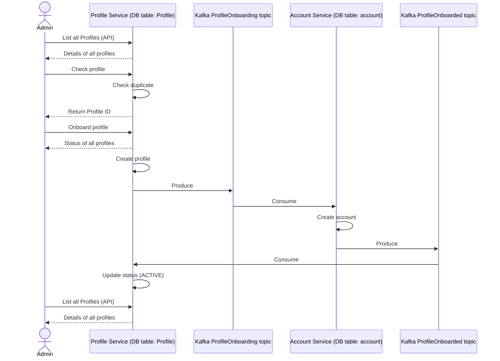
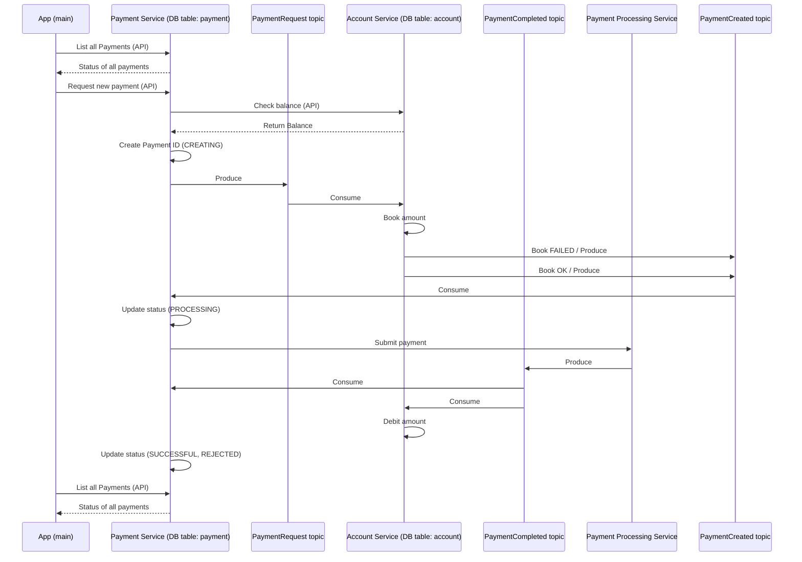

# Webflux Kafka

### Luồng ProfileService và AccountService

```mermaid
sequenceDiagram
    actor Admin
    participant ProfileService as Profile Service (DB table: Profile)
    participant ProfileOnboardingTopic as Kafka ProfileOnboarding topic
    participant AccountService as Account Service (DB table: account)
    participant ProfileOnboardedTopic as Kafka ProfileOnboarded topic

    Admin->>ProfileService: List all Profiles (API)
    ProfileService-->>Admin: Details of all profiles

    Admin->>ProfileService: Check profile
    ProfileService->>ProfileService: Check duplicate
    ProfileService-->>Admin: Return Profile ID

    Admin->>ProfileService: Onboard profile
    ProfileService-->>Admin: Status of all profiles

    ProfileService->>ProfileService: Create profile
    ProfileService->>ProfileOnboardingTopic: Produce

    ProfileOnboardingTopic->>AccountService: Consume
    AccountService->>AccountService: Create account
    AccountService->>ProfileOnboardedTopic: Produce

    ProfileOnboardedTopic->>ProfileService: Consume
    ProfileService->>ProfileService: Update status (ACTIVE)

    Admin->>ProfileService: List all Profiles (API)
    ProfileService-->>Admin: Details of all profiles
```

### Luồng PaymentService

```mermaid
sequenceDiagram
    participant App as App (main)
    participant PaymentService as Payment Service (DB table: payment)
    participant PaymentRequestTopic as PaymentRequest topic
    participant AccountService as Account Service (DB table: account)
    participant PaymentCompletedTopic as PaymentCompleted topic
    participant PaymentProcessingService as Payment Processing Service
    participant PaymentCreatedTopic as PaymentCreated topic

    %% Flow: Listing all payments
    App->>PaymentService: List all Payments (API)
    PaymentService-->>App: Status of all payments

    %% Flow: Requesting a new payment
    App->>PaymentService: Request new payment (API)
    PaymentService->>AccountService: Check balance (API)
    AccountService-->>PaymentService: Return Balance
    PaymentService->>PaymentService: Create Payment ID (CREATING)
    PaymentService->>PaymentRequestTopic: Produce

    %% Flow: Account Service processes payment request
    PaymentRequestTopic->>AccountService: Consume
    AccountService->>AccountService: Book amount
    AccountService->>PaymentCreatedTopic: Book FAILED / Produce
    AccountService->>PaymentCreatedTopic: Book OK / Produce

    %% Flow: Payment Service consumes and updates status
    PaymentCreatedTopic->>PaymentService: Consume
    PaymentService->>PaymentService: Update status (PROCESSING)
    PaymentService->>PaymentProcessingService: Submit payment

    %% Flow: Payment Processing Service updates and produces result
    PaymentProcessingService->>PaymentCompletedTopic: Produce

    %% Flow: Payment Service and Account Service consume completion
    PaymentCompletedTopic->>PaymentService: Consume
    PaymentCompletedTopic->>AccountService: Consume
    AccountService->>AccountService: Debit amount

    %% Flow: Final status update
    PaymentService->>PaymentService: Update status (SUCCESSFUL, REJECTED)

    %% Flow: Listing all payments again
    App->>PaymentService: List all Payments (API)
    PaymentService-->>App: Status of all payments
```
